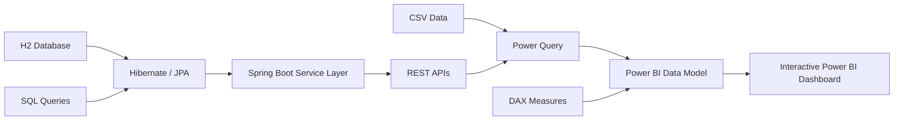

# Business Intelligence Dashboard | Power BI & Spring Boot

A full-stack Business Intelligence portfolio project that combines a **Java 8 Spring Boot REST API** with **Power BI** to analyze and visualize business sales data.

The project demonstrates backend API development, database integration, data transformation, business intelligence reporting, testing, validation, and exception handling using **Java, Spring Boot, REST APIs, Hibernate/JPA, SQL, Power BI, Power Query, DAX, JUnit, and Mockito**.

## Project Overview

The application provides business and sales data through Spring Boot REST APIs and transforms the data into interactive Power BI dashboards.

The dashboard is designed to help analyze key business metrics such as:

- Total revenue
- Profit and profit margin
- Total orders
- Average order value
- Monthly sales trends
- Product category performance
- Customer segment performance
- Regional performance
- Sales channel performance

## Key Features

- Developed RESTful APIs using **Java 8 and Spring Boot** to provide business data for reporting and analytics.
- Implemented layered architecture using **Controller, Service, Repository, and Model** components.
- Used **Hibernate/JPA and SQL** for data persistence, retrieval, and aggregation.
- Integrated REST API and CSV-based data sources with **Power BI**.
- Used **Power Query** for data loading, cleaning, and transformation.
- Created **DAX measures** for business KPIs and analytical calculations.
- Built dashboard visualizations for revenue, profit, trends, categories, regions, customer segments, and sales channels.
- Implemented request validation and centralized exception handling for REST APIs.
- Developed unit tests using **JUnit and Mockito** for service-layer functionality.
- Included sample data and SQL examples to make the project easy to run and demonstrate.

## Technology Stack

| Area | Technologies |
|---|---|
| Backend | Java 8, Spring Boot |
| API | RESTful APIs, JSON |
| Database | H2, SQL |
| Persistence | Hibernate, JPA |
| Business Intelligence | Power BI |
| Data Transformation | Power Query |
| Analytics | DAX |
| Testing | JUnit, Mockito |
| Build Tool | Maven |

## Architecture



### Data Flow

```text
Database / CSV
      ↓
Hibernate / JPA
      ↓
Spring Boot Service
      ↓
REST API
      ↓
Power Query
      ↓
Power BI Data Model
      ↓
DAX Measures
      ↓
Dashboard & Reports
```
## Getting Started

### Prerequisites

Make sure the following tools are available:

- Java 8 or newer
- Maven 3.8+
- Power BI Desktop (optional for building the dashboard)

### Run the Spring Boot Application

```bash
mvn spring-boot:run
```

The application will start locally on:

```text
http://localhost:8080
```

## REST API Example

Retrieve dashboard KPI information:

```bash
curl "http://localhost:8080/api/dashboard/kpis?startDate=2024-01-01&endDate=2024-12-31"
```

Example flow:

```text
Client Request
      ↓
REST Controller
      ↓
Service Layer
      ↓
JPA Repository
      ↓
Database
      ↓
JSON Response
```

## Run Unit Tests

Execute the test suite using:

```bash
mvn test
```

The project uses **JUnit and Mockito** to test business and service-layer functionality.

## Power BI Dashboard Setup

The repository keeps Power BI resources in source-control-friendly formats instead of committing a binary `.pbix` file.

A browser-based preview of the dashboard concept is available at:

`docs/dashboard-preview.html`

The preview demonstrates:

- KPI cards
- Monthly revenue and profit trends
- Product category performance
- Sales channel performance
- Customer segment and regional analysis

### Build the Report in Power BI

1. Start the Spring Boot application.
2. Open **Power BI Desktop**.
3. Select **Get Data → Blank Query → Advanced Editor**.
4. Import the Power Query scripts from:

```text
powerbi/power-query/
```

5. Load the sample CSV files from:

```text
data/
```

or use:

```text
SalesRecordsApi.pq
```

to retrieve data from the Spring Boot REST API.

6. Create the required DAX measures using:

```text
powerbi/dax/measures.dax
```

7. Follow the dashboard layout documentation:

```text
docs/dashboard-layout.md
```

## Recommended Dashboard Visuals

The Power BI report can include:

- **KPI Cards** — Total Revenue, Profit Margin, Total Orders, Average Order Value
- **Line Chart** — Monthly Revenue and Profit Trends
- **Bar Chart** — Product Category Performance
- **Matrix / Stacked Bar Chart** — Customer Segment by Region
- **Channel Analysis** — Online, Partner, and Direct Sales
- **Slicers** — Date, Region, Channel, Category, and Customer Segment

## Business Use Case

The sample dataset represents a sales organization operating across multiple regions, product categories, customer segments, and sales channels.

The dashboard helps business users answer questions such as:

- Which product categories generate the highest revenue and profit?
- How are revenue and profit trending month over month?
- Which customer segments contribute the most to overall sales?
- Which regions are performing strongly?
- How do online, partner, and direct sales channels compare?
- How do business KPIs change when users apply different filters?

## Skills Demonstrated

This project demonstrates practical experience with:

**Java Development**  
Java 8, Spring Boot, REST API development, validation, and exception handling.

**Database Development**  
Hibernate, JPA, SQL queries, data aggregation, and persistence.

**Business Intelligence**  
Power BI, Power Query, DAX, KPI development, and interactive dashboard design.

**Testing**  
JUnit and Mockito unit testing.

**Full Application Flow**  
Database → Backend Service → REST API → Data Transformation → Power BI → Business Dashboard.

## Project Purpose

This project was created to demonstrate how **Java/Spring Boot backend development can be integrated with Power BI** to build an end-to-end business intelligence solution.

It highlights experience across **backend development, REST API integration, database operations, data transformation, analytics, testing, and business reporting**.
