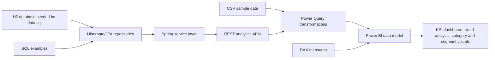

# Business Intelligence Dashboard | Power BI & Spring Boot

A full-stack Business Intelligence portfolio project that combines a **Java 8 Spring Boot REST API** with **Power BI** to analyze and visualize business sales data.

The project demonstrates backend API development, database integration, data transformation, business intelligence reporting, testing, validation, and exception handling using **Java, Spring Boot, REST APIs, Hibernate/JPA, SQL, Power BI, Power Query, DAX, JUnit, and Mockito**.

## Project Overview

The application provides business and sales data through Spring Boot REST APIs and transforms the data into interactive Power BI dashboards.

The dashboard is designed to help analyze key business metrics such as:

- Total revenue
- Profit and profit margin
- Total orders
- Average order value
- Monthly sales trends
- Product category performance
- Customer segment performance
- Regional performance
- Sales channel performance

## Architecture



## Quick Start

Requirements:

- Java 8 or newer
- Maven 3.8 or newer
- Power BI Desktop, optional for building the report

Run the API:

```bash
mvn spring-boot:run
```

Try an endpoint:

```bash
curl "http://localhost:8080/api/dashboard/kpis?startDate=2024-01-01&endDate=2024-12-31"
```

Run tests:

```bash
mvn test
```

## Power BI Report Build

This repository intentionally keeps Power BI assets in source-control friendly formats instead of committing a binary `.pbix` file.

For a quick visual preview of the finished report concept, open [docs/dashboard-preview.html](docs/dashboard-preview.html) in a browser. It includes KPI cards, a monthly trend chart, category performance bars, a channel revenue chart, and a segment/region matrix using the included sample data.

1. Start the Spring Boot API.
2. In Power BI Desktop, use **Get Data > Blank Query > Advanced Editor**.
3. Paste the scripts from [powerbi/power-query](powerbi/power-query).
4. Load the CSV files from [data](data) or use the `SalesRecordsApi.pq` query for the API-backed fact table.
5. Create measures from [powerbi/dax/measures.dax](powerbi/dax/measures.dax).
6. Follow [docs/dashboard-layout.md](docs/dashboard-layout.md) to assemble the report page.

Recommended visuals:

- KPI cards for total revenue, profit margin, total orders, and average order value
- Line chart for monthly revenue and profit trend
- Bar chart for product category performance
- Matrix or stacked bar chart for customer segment by region
- Slicers for date, region, channel, category, and segment

## Example Dashboard Story

The sample data models a small sales organization across three regions and multiple channels. The dashboard helps leadership answer:

- Which product categories generate the most revenue and profit?
- How are sales trending month over month?
- Which customer segments and regions are strongest?
- Are online, partner, and direct channels performing differently?

