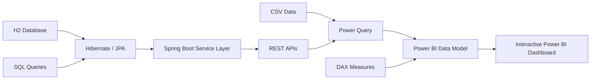

# Business Intelligence Dashboard | Power BI & Spring Boot

A full-stack Business Intelligence portfolio project that combines a **Java 8 Spring Boot REST API** with **Power BI** to analyze and visualize business sales data.

The project demonstrates backend API development, database integration, data transformation, business intelligence reporting, testing, validation, and exception handling using **Java, Spring Boot, REST APIs, Hibernate/JPA, SQL, Power BI, Power Query, DAX, JUnit, and Mockito**.

## Project Overview

The application provides business and sales data through Spring Boot REST APIs and transforms the data into interactive Power BI dashboards.

The dashboard is designed to help analyze key business metrics such as:

- Total revenue
- Profit and profit margin
- Total orders
- Average order value
- Monthly sales trends
- Product category performance
- Customer segment performance
- Regional performance
- Sales channel performance

## Key Features

- Developed RESTful APIs using **Java 8 and Spring Boot** to provide business data for reporting and analytics.
- Implemented layered architecture using **Controller, Service, Repository, and Model** components.
- Used **Hibernate/JPA and SQL** for data persistence, retrieval, and aggregation.
- Integrated REST API and CSV-based data sources with **Power BI**.
- Used **Power Query** for data loading, cleaning, and transformation.
- Created **DAX measures** for business KPIs and analytical calculations.
- Built dashboard visualizations for revenue, profit, trends, categories, regions, customer segments, and sales channels.
- Implemented request validation and centralized exception handling for REST APIs.
- Developed unit tests using **JUnit and Mockito** for service-layer functionality.
- Included sample data and SQL examples to make the project easy to run and demonstrate.

## Technology Stack

| Area | Technologies |
|---|---|
| Backend | Java 8, Spring Boot |
| API | RESTful APIs, JSON |
| Database | H2, SQL |
| Persistence | Hibernate, JPA |
| Business Intelligence | Power BI |
| Data Transformation | Power Query |
| Analytics | DAX |
| Testing | JUnit, Mockito |
| Build Tool | Maven |

## Architecture

